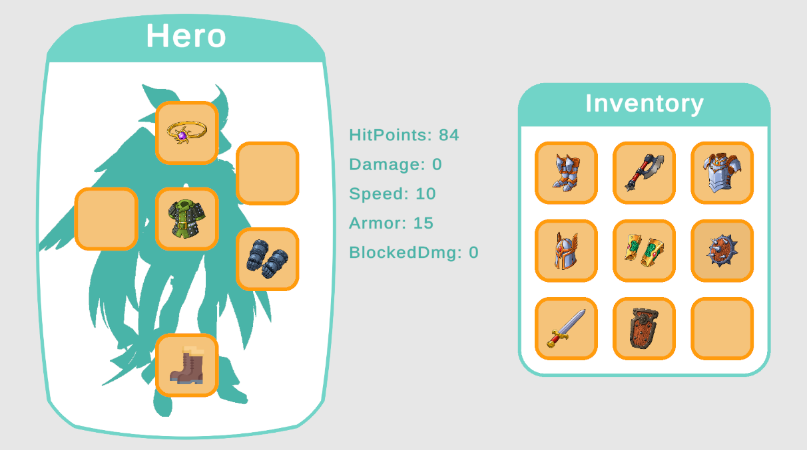

# Inventory

### Описание
Пример инвентаря и предметов, основанных на компонентном подходе.

### DI System
- VContainer

### Примененные принципы
- ООП
- SOLID
- DRY
- KISS
- YAGNI 

### Примененные паттерны
- Prototipe (GoF)
- Flyweight (GoF)
- Controller (GRASP)
- Information Expert (GRASP)
- Polymorphism (GRASP)
- Indirection (GRASP)
- Protected Variations (GRASP)
- MVP-Passive (MV*)

### Скриншоты

